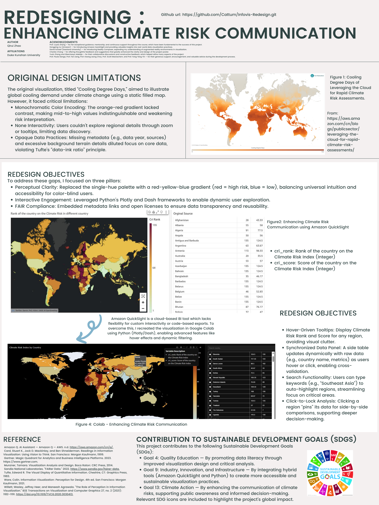

# Information Visualization Redesign Project

## Project Overview

This project presents a critical analysis and redesign of data visualization using Amazon QuickSight and Google Colab. 
It focuses on improving the original filledmap visualization in terms of perceptual clarity, interactivity, and data transparency.

The project was completed for the course INFOSCI 301 at Duke Kunshan University, instructed by Professor Luyao Zhang.

> Author: Qirui Zhao  
> Date: April 13, 2025

---

## Poster Showcase

*The poster summarizes the research background, critique process, redesign strategies, and key visualization outcomes.*

---

## Acknowledgments

I would like to sincerely thank all those who contributed to the development of this InfoVis Redesign Project:

- **Prof. Luyao Zhang** — for her exceptional guidance, mentorship, and continuous support throughout the course, which have been fundamental to the success of this project.
- **Dongping Liu** (Amazon) — for introducing Amazon QuickSight and providing valuable insights into real-world data visualization practices.
- **David Schaaf** (Saarland University) — for introducing Reality Composer, expanding my understanding of augmented reality environments in visualization.
- **Charles Chang** — for offering thoughtful feedback and suggestions that greatly enhanced the clarity and design of the project poster.
- **Yuxin Zhang** and **Gbemisayo Adelaja** — for their collaborative discussions and constructive feedback, which helped refine many aspects of the project.
- **Prof. Paula Ganga**, **Prof. Fan Liang**, **Prof. Kwang Leong Choy**, **Prof. Scott MacEachern**, and **Prof. Fang-fang Yin** — for their generous support, encouragement, and valuable advice during the development process.

I am deeply grateful for the academic and professional community that made this project possible.

---

## Repository Structure

This repository contains all relevant materials for the project, including the article, source data, code, and visual outputs.

- README.md                                         &emsp; # Project introduction and structure
- Information Visualization Redesign Project.docx   &emsp; # Final article and project documentation
- climate-risk-index-1.csv                          &emsp; # Original datasets used for visualization
- redesign_visualization_colab.ipynb                &emsp; # Google Colab Jupyter notebook for reproduction
- poster.png                                       &emsp; # Final project poster

---

## Project Highlights

- Data Visualization Critique based on visual perception theory and data ethics.
- Literature-inspired analysis combining superpower metaphors with immersive visualization techniques.
- Redesign Implementation:
  - Used Amazon QuickSight to generate reference images.
  - Used Google Colab to recreate fully customized interactive visualizations.
  - Enhanced features including dynamic filtering, tooltip customization, hover functions, and drill-down views.

---

## Visualization Features

- Diverging color scale (Red → Yellow → Blue) for data clarity.
- Dark mode for reducing visual noise.
- Metadata links and FAIR principle compliance (Findable, Accessible, Interoperable, Reusable).
- Dataset context and user-friendly interactions.

---

## Data Source

- SaaS-Sales.csv for sales profit analysis (Discount vs Quantity vs Profit).
- Climate Risk Index dataset from Kaggle for final visualization:  
[Climate Risk Dataset - Kaggle] https://www.kaggle.com/datasets/thedevastator/global-climate-risk-index-and-related-economic-l?resource=download

---

## Contribution to Sustainable Development Goals (SDGs)

This Information Visualization Redesign Project actively supports several United Nations Sustainable Development Goals (SDGs) by advancing data accessibility, promoting environmental awareness, and fostering innovative visualization practices grounded in critical theory and practical application.

### Relevant SDGs:

-   
  **Goal 4: Quality Education**  
  Through critical engagement with visualization theory and practice, the project promotes higher standards of data literacy and empowers users to interact with complex environmental data more effectively.

-   
  **Goal 9: Industry, Innovation, and Infrastructure**  
  By integrating hybrid visualization methods using Amazon QuickSight and Python, the project advances sustainable innovation and data infrastructure.

-   
  **Goal 13: Climate Action**  
  The redesigned visualization improves climate risk communication, fostering public understanding and informed action toward climate change mitigation.

In addition, by adhering to the FAIR (Findable, Accessible, Interoperable, and Reusable) data principles, this project contributes to strengthening global knowledge infrastructures, supporting open science, transparency, and equitable information access.

## Contribution to Sustainable Development Goals (SDGs)

This project contributes to the following Sustainable Development Goals (SDGs):

- **Goal 4: Quality Education** — By promoting data literacy through improved visualization design and critical analysis.
- **Goal 9: Industry, Innovation, and Infrastructure** — By integrating hybrid tools (Amazon QuickSight and Python) to create more accessible and sustainable visualization practices.
- **Goal 13: Climate Action** — By enhancing the communication of climate risks, supporting public awareness and informed decision-making.

Relevant SDG icons are included to highlight the project's global impact.

---

## Dependencies

- Python 3.x  
- Google Colab environment  
- Pandas, Matplotlib, Seaborn, Plotly

---
